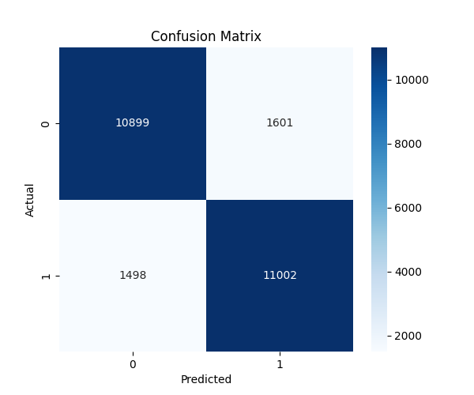

🎬 IMDb Sentiment Analysis
🔍 Film Yorumlarında Duygu Analizi (Positive / Negative)

Bu proje, IMDb film yorumlarını kullanarak bir duygu analizi (sentiment analysis) modeli geliştirmektedir.
Amaç, bir yorumun olumlu (positive) veya olumsuz (negative) olup olmadığını makine öğrenmesi ile otomatik olarak belirlemektir.

📑 İçindekiler

📌 Projenin Amacı

📂 Veri Seti

🧼 Preprocessing (Ön İşleme Adımları)

🧠 TF-IDF Özellik Çıkarımı

🤖 Kullanılan Model

📊 Sonuçlar ve Metrikler

🖼 Confusion Matrix

🧪 Örnek Cümle Testleri

📁 Proje Yapısı

📦 Kurulum ve Çalıştırma

📜 Requirements

📌 Projenin Amacı

Bu ödevin amacı:

IMDb film yorumlarından duygu analizi yapmak

Metinleri preprocess ederek model için temiz hale getirmek

TF-IDF yöntemini kullanarak sayısallaştırmak

Logistic Regression ile bir sınıflandırma modeli kurmak

Modeli accuracy, precision, recall, F1-score metrikleriyle değerlendirmek

Confusion Matrix görselleştirmek

📂 Veri Seti

Bu projede kullanılan veri seti:

IMDb Movie Reviews Dataset

50.000 yorum

%50 pozitif, %50 negatif

HuggingFace üzerinden çekilmiştir

from datasets import load_dataset
dataset = load_dataset("imdb")

🧼 Preprocessing (Ön İşleme Adımları)

Model eğitimi öncesi metinler aşağıdaki adımlardan geçmiştir:

Adım	Açıklama
lowercase	Tüm metni küçük harfe çevirme
Punctuation removal	Noktalama işaretlerini temizleme
Number removal	Sayıları kaldırma
Stopwords temizleme	"the, is, are..." gibi gereksiz kelimeleri kaldırma
Lemmatization	Kelimeleri kök forma dönüştürme
Whitespace cleanup	Gereksiz boşlukları temizleme

Kullanılan fonksiyon:

def preprocess_text(text):
    text = text.lower()
    text = re.sub(r"[^\w\s]","",text)
    text = re.sub(r"\d+","",text)
    words = text.split()
    new_words = []
    for w in words:
        if w not in stop_words and len(w) > 1:
           lemmatized_word = lemmatizer.lemmatize(w)
           new_words.append(lemmatized_word)
    return " ".join(new_words)

🧠 TF-IDF Özellik Çıkarımı

Bu projede metin sayısallaştırma için TF-IDF kullanılmıştır.

Kullanılan parametreler:

tfidf = TfidfVectorizer(
    max_features=5000,     # Kelime sayısını sınırlar
    ngram_range=(1,2),     # Unigram + Bigram
    stop_words="english"   # İngilizce stopwords
)

🤖 Kullanılan Model

Logistic Regression seçilmiştir.

Seçilme nedeni:

Metin sınıflandırmada güçlü performans

Hızlı eğitilir

TF-IDF ile yüksek doğruluk verir

Aşırı öğrenmeye çok meyilli değildir

Model kurulumu:

model = LogisticRegression(max_iter=200, random_state=42)

📊 Sonuçlar ve Metrikler
Metrik	Değer
Accuracy	0.87604
Precision	0.87296
Recall	0.88016
F1-score	0.87655

Sonuçlar results/metrics.txt dosyasında saklanır.

🖼 Confusion Matrix

Confusion matrix aşağıdaki dosyada kaydedilmiştir:

📌 results/confusion_matrix.png

🧪 Örnek Cümle Testleri

Modelin bazı örnek cümle tahminleri:

Cümle	Tahmin
They said the movie was absolutely legendary!	Positive
I laughed much, this movie was comical.	Positive
Amazing visuals and great soundtrack.	Positive
The acting was perfect but the story disappointing.	Negative
Terrible movie, waste of time.	Negative
📁 Proje Yapısı
project/
├── README.md
├── requirements.txt
├── sentiment_analysis.py
└── results/
    ├── metrics.txt
    └── confusion_matrix.png

📦 Kurulum ve Çalıştırma
1️⃣ Gerekli kütüphaneleri yükleyin
pip install -r requirements.txt

2️⃣ Scripti çalıştırın
python sentiment_analysis.py

3️⃣ Sonuçlar results/ klasörüne kaydedilir.
📜 Requirements
datasets
nltk
scikit-learn
numpy
pandas
matplotlib
seaborn
tqdm

🎯 Sonuç

Bu proje, klasik NLP yöntemleri ile duygu analizi yapmanın tam bir örneğini sunar.
TF-IDF + Logistic Regression kombinasyonu ile yüksek doğruluk elde edilmiştir.
